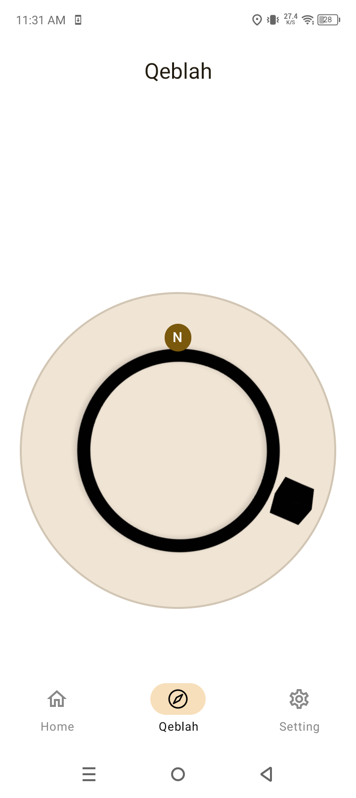
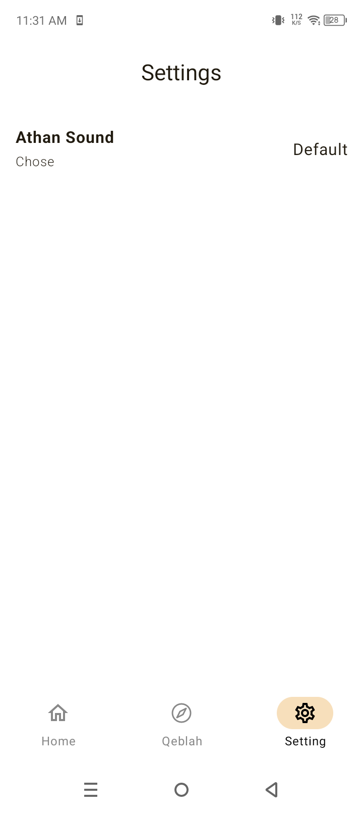

# Athan App

A modern and user-friendly Athan application for the Muslim community. This app helps you stay on top of your daily prayers with accurate prayer times, a Qibla compass, and customizable settings.

## Features

*   **Prayer Times:** Get accurate prayer times based on your location. The app also displays a countdown to the next prayer.
*   **Qibla Compass:** A simple and accurate compass to find the direction of the Kaaba in Mecca.
*   **Customization:** Personalize your experience by changing the app's theme and language.

## Screenshots

*(Add some screenshots of your applicati## Screenshots

 
 

## Installation

You can download the latest version of the application from the [releases page](https://github.com/your-username/your-repo/releases) or from the Google Play Store at [Your App URL](https://play.google.com/store/apps/details?id=your.package.name).

## Stitch Design

You can view the app's design on Stitch: [Athan App Design](https://stitch.withgoogle.com/u/1/projects/13401625596335935523)

## Contributing

Contributions are welcome! If you have any ideas, suggestions, or bug reports, please open an issue or submit a pull request.

## License

This project is licensed under the [MIT License](LICENSE).
